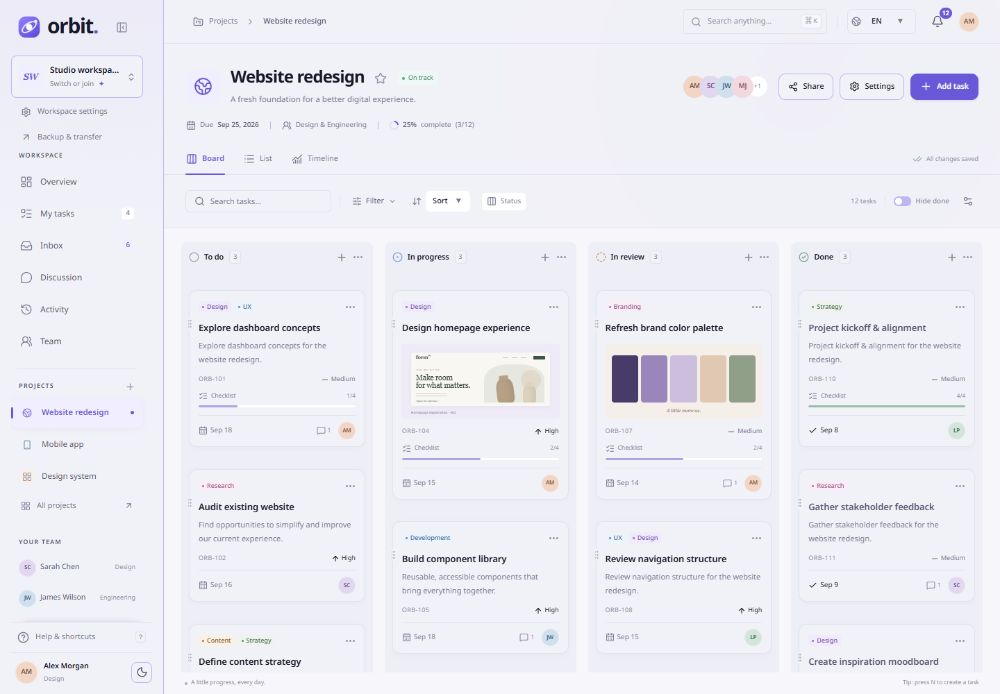
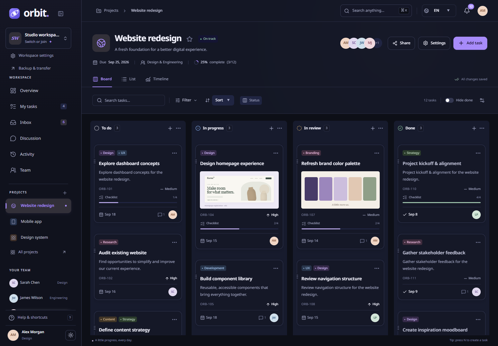
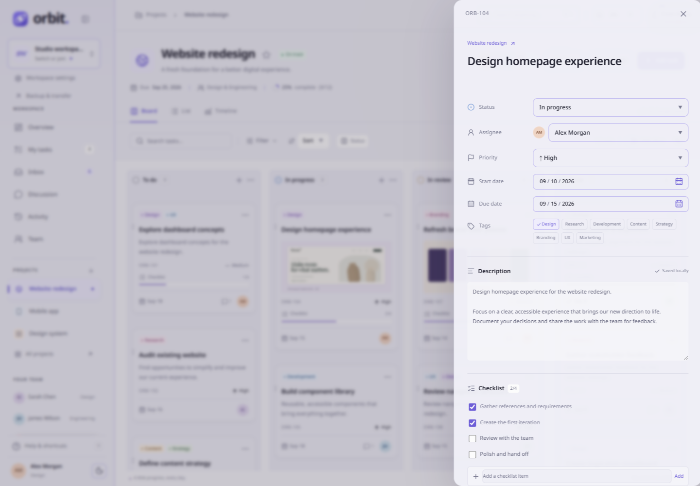
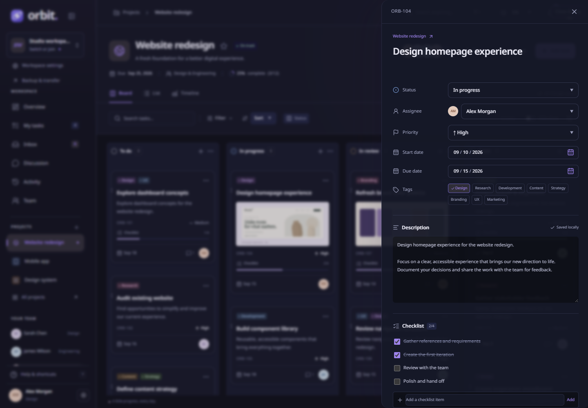
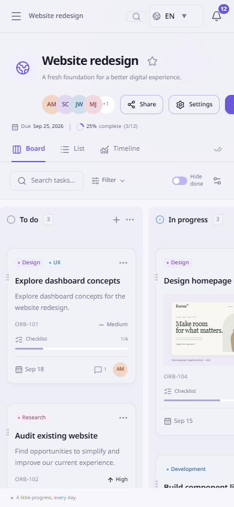
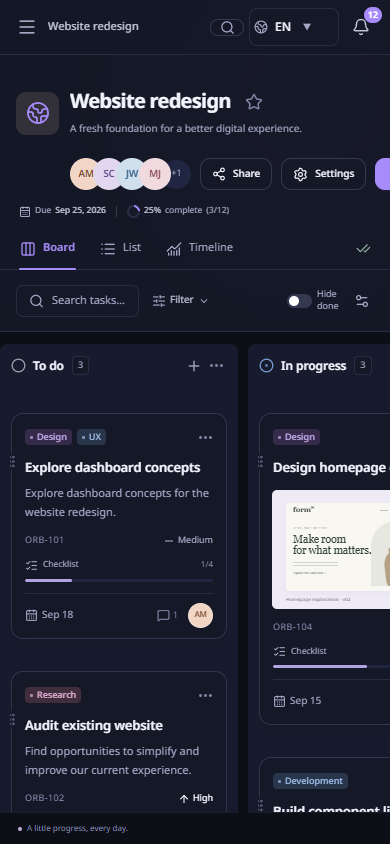
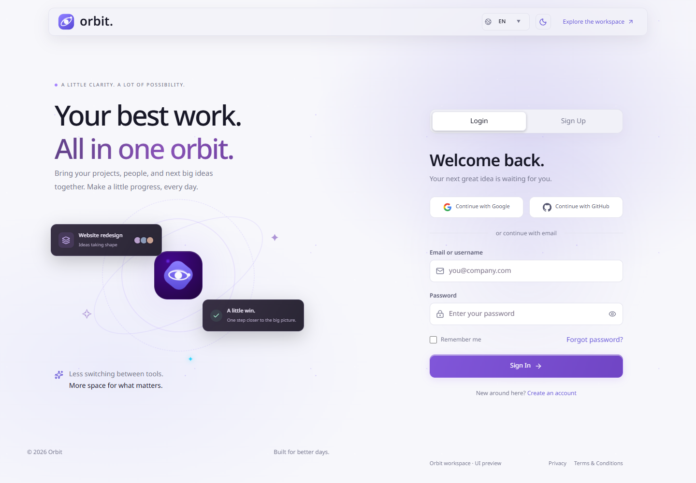
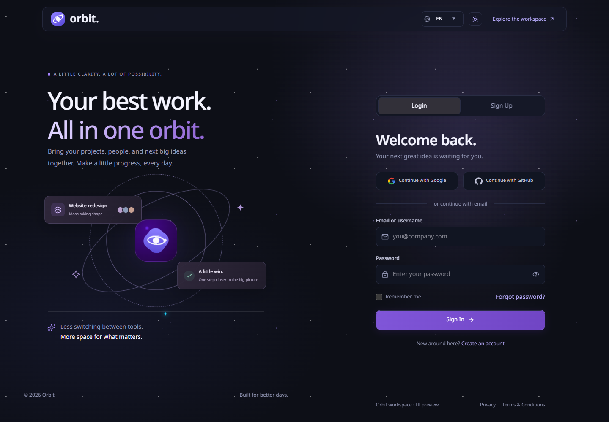
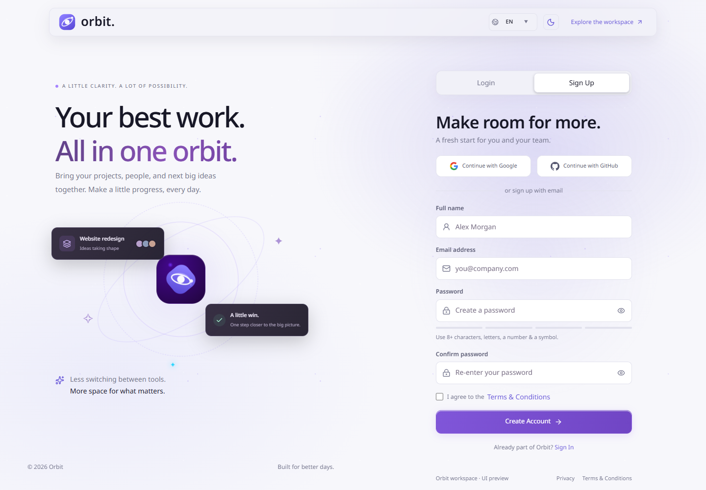
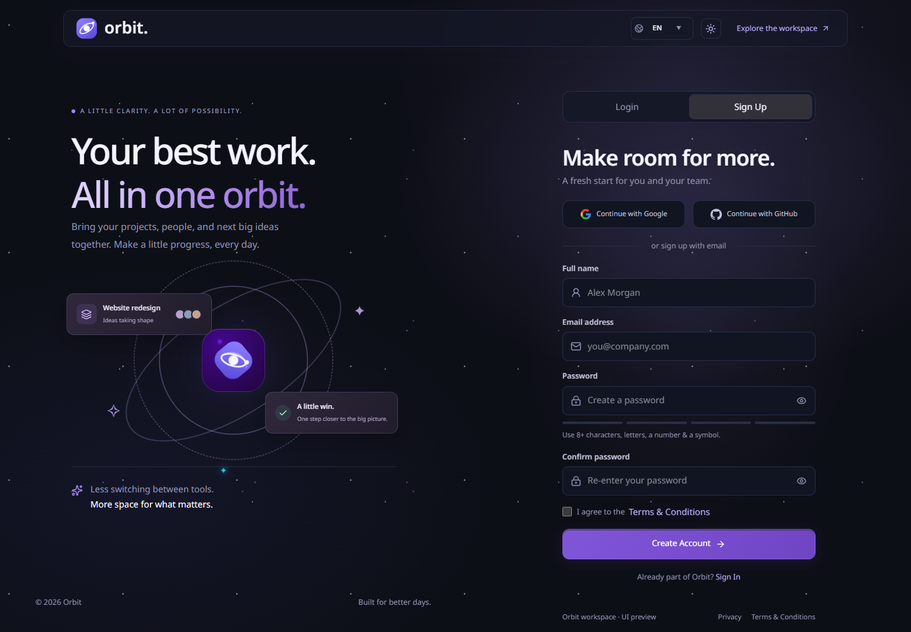

# Orbit — Unified Workspace

A working Next.js frontend for projects, tasks and teams, with a virtualized Kanban board, list, timeline, dashboard and collaborative task descriptions.

The account UI is available at [/auth](http://localhost:3000/auth), and the workspace is at [/workspace](http://localhost:3000/workspace).

The app-wide theme and reusable UI components are documented in [Shared UI and theme](docs/shared-ui-and-theme.md). Login, Sign Up and Workspace share Light/Dark/System preferences; controls live in `shared/theme` and generic components in `shared/ui`.

## App preview

### Workspace board

| Light | Dark |
| --- | --- |
|  |  |

### Task detail

| Light | Dark |
| --- | --- |
|  |  |

### Mobile workspace

| Light | Dark |
| --- | --- |
|  |  |

### Sign in

| Light | Dark |
| --- | --- |
|  |  |

### Sign up

| Light | Dark |
| --- | --- |
|  |  |

The dark account screen includes responsive split-screen branding, Login / Sign Up tabs with Framer Motion, keyboard navigation, password visibility, registration strength feedback, and React Hook Form / Zod validation. Social sign-in, recovery and registration currently explain their preview status; no credentials are logged, persisted or submitted, and no account or verification email is created. Connect an authentication service before enabling real account access. Workspace navigation remains available through the explicit demo link.

Run `npx playwright test tests/e2e/auth.spec.ts` with the dev server running to verify account interactions, accessibility and the sidebar width transition. Animations honor reduced-motion preferences. The tab indicator uses [Motion shared layout animation](https://motion.dev/docs/react-layout-animations), and form panels use [AnimatePresence](https://motion.dev/docs/react-animate-presence).

## Run

Use Node.js 22.18+ (Node 25 was used for validation).

```sh
npm install
npm run dev
```

Open [localhost:3000](http://localhost:3000). The workspace starts with sample projects. Edits persist in this browser; open a second tab on the same origin to try live task and description synchronization.

```sh
npm run build
npm start
```

The build fetches Geist through `next/font/google`, so the build environment needs access to Google Fonts. Font files are served by the built application.

## Checks

```sh
npm run lint
npm run typecheck
npm test
npm run test:e2e
```

Start the app before running browser tests. Playwright defaults to installed Microsoft Edge. Set `PLAYWRIGHT_CHANNEL=chrome` to use installed Chrome and `PLAYWRIGHT_BASE_URL` to test another port or a production server. Browser screenshots are written to `artifacts/`; failure traces go to `test-results/`.

## Architecture and scope

- [Frontend architecture and UI/UX specification](docs/unified-workspace-frontend-spec.md)
- [Implementation boundaries, features and backend integration](docs/frontend-implementation.md)
- [Optimistic reconciliation reference](docs/reference/optimistic-task.ts)

The frontend uses React, TypeScript, TanStack Query/Virtual, Zustand, dnd-kit, Recharts and Yjs. Source is organized by feature under `features/`; shared tokens and UI live in `app/globals.css` and `shared/`.

The current adapter stores data locally and synchronizes between tabs. Authentication, remote task APIs, invitations, remote presence and historical analytics need backend integration. This is not a hosted multi-user service.

For an existing compatible Yjs service, copy `.env.example` to `.env.local`, configure `NEXT_PUBLIC_YJS_WEBSOCKET_URL`, and restart the app. This connects description documents only; the service must provide authorization, persistence and document initialization. Leave it unset for the local demo.
