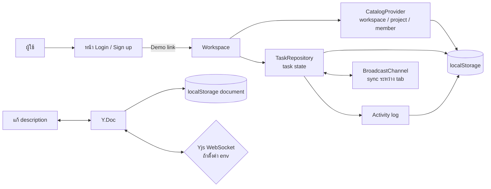
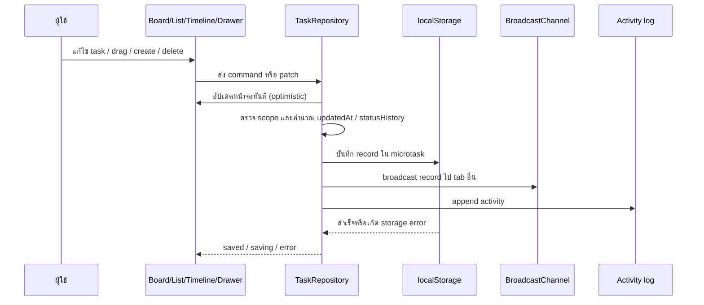
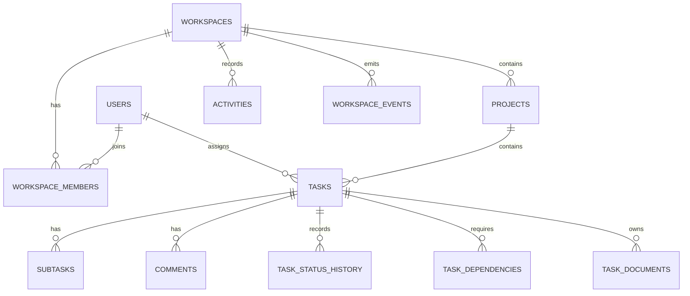
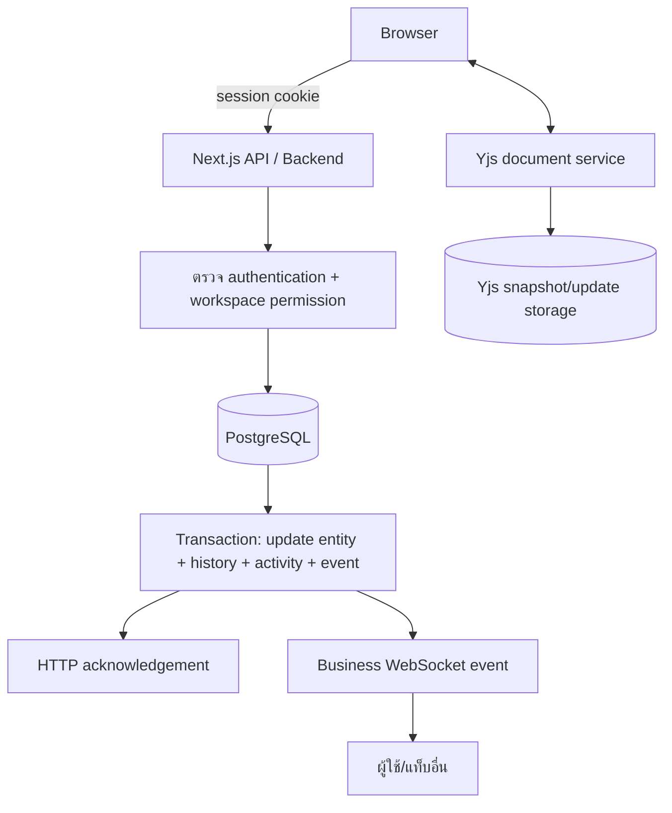

# Flow การทำงานของแอปและฐานข้อมูล Orbit

เอกสารนี้อธิบายการทำงานของ Orbit ตามโค้ดใน repository ปัจจุบัน และแนวทางเมื่อเปลี่ยนจาก demo แบบ local-first ไปเป็นระบบที่มี backend/database จริง

## 1. ภาพรวมระบบปัจจุบัน

ปัจจุบัน Orbit ยังไม่มี API server หรือฐานข้อมูลกลาง ข้อมูลถูกเก็บใน browser ของผู้ใช้แต่ละคนด้วย `localStorage` ดังนั้นข้อมูลจึงไม่ใช่ข้อมูลร่วมกันระหว่างเครื่อง และการล้าง browser storage จะทำให้ข้อมูล demo หาย



ข้อสำคัญ: หน้า authentication ตรวจสอบและแสดง validation เท่านั้น ยังไม่มีการสร้าง account, session, การส่ง password หรือ verification email จริง

## 2. Flow การเปิดแอป

1. Next.js render route `/` หรือ `/auth` และโหลด theme/language ที่ผู้ใช้เลือกไว้
2. ผู้ใช้เข้า `/workspace`
3. `CatalogProvider` อ่าน workspace, project และ member จาก `localStorage`
4. ถ้าไม่พบข้อมูล จะใช้ข้อมูลตั้งต้นของ workspace `studio` พร้อม 3 projects และสมาชิกตัวอย่าง
5. `WorkspaceProvider` สร้าง task repository ตาม workspace ที่ active
6. Repository โหลด task, subscribe การเปลี่ยนแปลง และเปิด `BroadcastChannel`
7. UI แสดง Board, List, Timeline, Overview หรือหน้าอื่น โดยทุก view อ่าน task จาก repository เดียวกัน

การเปลี่ยน workspace จะเปลี่ยน storage prefix และสร้าง repository scope ใหม่ ทำให้ task ของแต่ละ workspace แยกจากกันใน browser เดียวกัน

## 3. Flow การทำงานของ Task



กฎหลักของ task:

- task ใหม่สร้าง ID รูปแบบ `ORB-XXXXXX`
- การเปลี่ยน status จะเพิ่ม `statusHistory`
- การย้าย task ใช้ `rank` และตรวจ anchor/ลำดับ
- dependency ห้ามอ้างถึง task ที่ถูกลบ, คนละ project, ตัวเอง หรือทำให้เกิด cycle
- delete เป็น logical delete (`deleted: true`) ไม่ใช่การลบ bytes ออกจาก storage
- ถ้าบันทึกไม่สำเร็จ จะ rollback เฉพาะ mutation ล่าสุดที่ยังไม่มี mutation ใหม่ทับ
- การแก้ title, status, assignee, date และ metadata อยู่ใน task repository
- การแก้ description อยู่ใน Yjs แยกจาก task metadata เพื่อรองรับการแก้พร้อมกันระดับตัวอักษร

## 4. ข้อมูลที่เก็บใน browser ปัจจุบัน

| กลุ่มข้อมูล  | key/prefix หลัก                                  | รูปแบบ                             |
| ----------------------- | ---------------------------------------------------- | ---------------------------------------- |
| Workspace               | `orbit.catalog.workspace.v1.{workspaceId}`         | 1 JSON record ต่อ workspace           |
| Project                 | `orbit.catalog.project.v1.{projectId}`             | 1 JSON record ต่อ project             |
| Member                  | `orbit.catalog.member.v1.{workspaceId}.{memberId}` | 1 JSON record ต่อสมาชิก         |
| Task ของ Studio      | `orbit.workspace.task.v1.{taskId}`                 | 1 JSON record ต่อ task                |
| Task workspace อื่น | `orbit.workspace.{workspaceId}.task.v1.{taskId}`   | 1 JSON record ต่อ task                |
| Discussion              | `orbit.workspace.discussion.v1.{workspaceId}`      | JSON array                               |
| Activity                | `orbit.workspace.activity.v1.{workspaceId}`        | JSON array สูงสุด 500 รายการ |
| Preferences             | `orbit.workspace.preferences.v1.{workspaceId}`     | JSON object                              |
| Description             | `orbit.document.v1.{taskId}`                       | encoded Yjs update                       |

การ export backup จะรวม workspace, projects, members, tasks, discussion และ activity เป็น JSON format `orbit-workspace-backup` version 1 และ import จะตรวจสอบด้วย Zod ก่อน restore

## 5. Database ที่แนะนำสำหรับ Production

ควรใช้ PostgreSQL เป็นฐานข้อมูลหลัก โดยแยก entity ที่เปลี่ยนแปลงบ่อยออกจากกัน และใช้ foreign key แทนการฝังข้อมูลซ้ำใน task



### ตารางหลัก

| ตาราง                            | คอลัมน์สำคัญ                                                                                                                                                                | หน้าที่                          |
| ------------------------------------- | --------------------------------------------------------------------------------------------------------------------------------------------------------------------------------------- | --------------------------------------- |
| `users`                             | `id`, `email`, `name`, `password_hash`, `created_at`                                                                                                                          | account และ identity                 |
| `workspaces`                        | `id`, `name`, `invite_code`, `owner_id`, `created_at`, `deleted_at`                                                                                                         | tenant หลัก                         |
| `workspace_members`                 | `workspace_id`, `user_id`, `role`, `team`, `joined_at`                                                                                                                        | สมาชิกและสิทธิ์          |
| `projects`                          | `id`, `workspace_id`, `name`, `description`, `color`, `icon`, `due_on`, `deleted_at`                                                                                    | project ภายใน workspace            |
| `tasks`                             | `id`, `project_id`, `title`, `description_preview`, `status`, `priority`, `assignee_id`, `start_on`, `due_on`, `rank`, `revision`, `updated_at`, `deleted_at` | metadata ของงาน                   |
| `task_tags` / `tags`              | `task_id`, `tag_id`, `name`, `color`                                                                                                                                            | tag แบบ normalize                    |
| `subtasks`                          | `id`, `task_id`, `title`, `done`, `position`                                                                                                                                  | checklist                               |
| `comments`                          | `id`, `task_id`, `author_id`, `body`, `created_at`, `deleted_at`                                                                                                            | ความคิดเห็น                  |
| `task_dependencies`                 | `task_id`, `depends_on_task_id`                                                                                                                                                     | prerequisite และต้องกัน cycle |
| `task_status_history`               | `id`, `task_id`, `from_status`, `to_status`, `changed_by`, `changed_at`                                                                                                     | analytics ของ flow                   |
| `activities`                        | `id`, `workspace_id`, `actor_id`, `entity_type`, `entity_id`, `action`, `detail`, `created_at`                                                                          | activity/inbox                          |
| `workspace_events`                  | `seq`, `workspace_id`, `event_type`, `entity_id`, `payload`, `created_at`                                                                                                   | replayable event stream                 |
| `command_receipts`                  | `attempt_id`, `command_id`, `user_id`, `payload_hash`, `result`, `created_at`                                                                                               | idempotency และ retry                |
| `task_documents` หรือ Yjs store | `task_id`, `snapshot`, `updates`, `updated_at`                                                                                                                                  | durable description document            |

แนะนำ index อย่างน้อยที่ `workspace_members(workspace_id, user_id)`, `projects(workspace_id, deleted_at)`, `tasks(project_id, status, rank)`, `tasks(assignee_id, due_on)`, `activities(workspace_id, created_at)` และ `workspace_events(workspace_id, seq)`

## 6. Flow เมื่อมี Backend จริง



### อ่านข้อมูล

1. Server ตรวจ session และ membership ของ workspace
2. bootstrap ส่ง workspace snapshot, project/member lookup, task page และ `stream cursor`
3. client validate payload แล้วใส่ entity ลง replica/cache
4. filter และ view ใช้ task identity ชุดเดียวกัน ไม่ copy task ไปไว้ในแต่ละหน้า
5. business WebSocket ส่ง event หลัง commit เพื่อให้ client อื่น update ตามลำดับ `seq`
6. ถ้า sequence ขาด ให้ client ขอ replay; หาก replay หมดอายุให้โหลด snapshot ใหม่

### เขียนข้อมูล

1. UI สร้าง `commandId` และ `attemptId` พร้อม payload ที่ immutable
2. client แสดง optimistic state และส่ง command ไป API
3. API ตรวจสิทธิ์, revision, input schema และ idempotency
4. database transaction อัปเดต entity, เพิ่ม history/activity และเขียน event ในครั้งเดียว
5. API ส่ง acknowledgement กลับ และ event ถูก broadcast ไป business WebSocket
6. client merge ผลด้วย revision-aware reconciliation; acknowledgement เก่าต้องไม่เขียนทับข้อมูลใหม่กว่า
7. timeout หรือ network failure ให้ retry ด้วย `attemptId` เดิมและ payload เดิม ห้ามนำ idempotency key เดิมไปใช้กับ payload ใหม่

### Transaction ตัวอย่าง: เปลี่ยน status

```text
BEGIN
  SELECT task FOR UPDATE
  ตรวจว่า user มีสิทธิ์ใน workspace/project
  ตรวจ expected revision
  UPDATE tasks SET status = ..., revision = revision + 1, updated_at = ...
  INSERT INTO task_status_history (...)
  INSERT INTO activities (... action = 'moved' ...)
  INSERT INTO workspace_events (...)
  INSERT INTO command_receipts (...)
COMMIT
```

การย้ายข้าม column, เปลี่ยน dependency และ bulk action ควรเป็น command แบบ atomic ที่ server ไม่ควรพึ่งพา index ของ array จาก client แต่ให้ส่ง destination กับ neighbor IDs แล้วให้ server คำนวณ `rank`

## 7. ขอบเขตที่ต้องทำเพิ่มก่อนใช้งานจริง

- เชื่อม Login/Register กับ identity provider หรือ auth service และเก็บเฉพาะ password hash
- เพิ่ม API authorization ทุก request โดยตรวจ `workspace_members`
- ย้าย catalog/task/activity จาก `localStorage` ไป PostgreSQL
- เพิ่ม migration, backup, restore และ soft-delete retention policy
- ทำ command API, revision, idempotency receipt และ replayable event stream
- ทำ Yjs document authorization และ persistence แยกจาก business event socket
- เพิ่ม server-side pagination/filter/analytics เมื่อ task มีจำนวนมาก
- ไม่ถือว่า workspace ID, invite code หรือ client-supplied actor ID เป็นหลักฐานสิทธิ์

สรุปคือโค้ดปัจจุบันเหมาะกับ prototype และการทดลอง UX แบบ offline ใน browser ส่วน production ต้องให้ PostgreSQL เป็น source of truth, API เป็นจุดตรวจสิทธิ์/transaction และ WebSocket/Yjs เป็นช่องทางกระจายการเปลี่ยนแปลงตาม ownership ของข้อมูล
