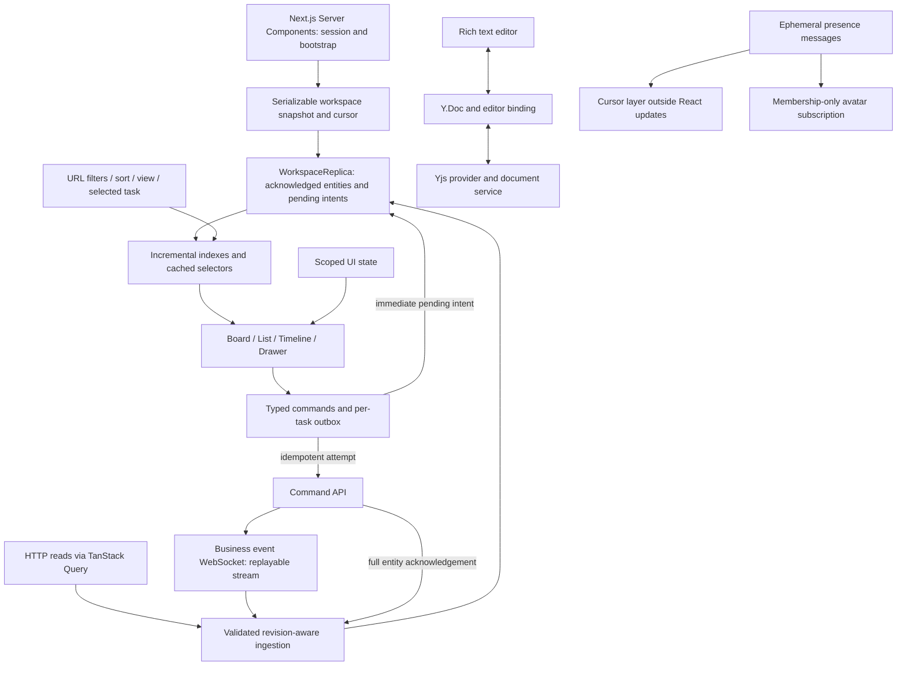

# Unified Workspace Platform: Frontend Architecture and UI/UX Specification

Status: implementation blueprint. Prepared for this repository on 9 September 2026.

The repository currently contains a Next.js 16.3.4, React 19.2.8, TypeScript, and Tailwind CSS 4 starter. This specification defines the platform to build. The executable reference accompanying it implements and tests the scalar optimistic reconciliation algorithm; the platform, services, and library integrations are proposed work.

Read by section: [Architecture](#1-frontend-architecture-overview), [Directory structure](#2-component-directory-structure), [Component specs and code](#3-core-component-specs-and-code-patterns), [Performance checklist](#4-performance-optimization-checklist).

## 1. Frontend Architecture Overview

### Architectural decision

Build a modular frontend with a server-rendered Next.js shell and a client-owned interactive workspace. Use a single normalized task replica for Board, List, Timeline, and Detail Drawer. Separate acknowledged business data, local interaction state, and collaboratively edited documents by ownership and update frequency.

Assumed capacity for the initial design: 10,000 lightweight task records in an active project, 50 columns, and 50 connected collaborators. Larger projects use server-filtered pages. Task descriptions and activity histories are fetched on demand. These are workload targets for validation, not measured capabilities of the starter.

| Concern | Choice | Reason and boundary |
| --- | --- | --- |
| Routing and initial render | Installed Next.js App Router and React | Server Components authenticate and bootstrap; Client Components own sustained interaction. |
| Request lifecycle | TanStack Query | Deduplicate reads, cancel requests, manage pagination and freshness, cache analytics. |
| Shared business state | `WorkspaceReplica`, an entity-keyed external store | One revision-aware merge path for HTTP results, WebSocket events, and pending commands. |
| Local UI state | Component state; scoped Zustand for shared UI preferences | Small selectors for sidebar, selection, density, and transient layout state. |
| Collaborative descriptions | Yjs v13 with a compatible stable `y-websocket` provider and editor binding | Character-level convergence, separate from task metadata commands. |
| Presence | Ephemeral room awareness plus imperative cursor renderer | Pointer traffic bypasses the task store and React render path. |
| Drag and drop | `@dnd-kit/react`, behind a feature adapter | Extensible input and collision handling for cross-column and timeline interactions. |
| Windowing | `@tanstack/react-virtual` | Measured row heights, configurable rendered ranges, and horizontal/vertical virtualization. |
| Charts | Recharts for bounded dashboard series | Product charts behind a consistent `ChartFrame`; custom timeline geometry remains separate. |
| Styling | Tailwind CSS 4 and semantic CSS variables | Shared tokens, accessible primitives, and CSS-driven theme changes. |

Use current package documentation when implementing, then pin and test compatible versions in the lockfile. In particular, dnd-kit's current React API uses `DragDropProvider` and `@dnd-kit/react/sortable`; legacy `DndContext` examples belong to a different API family. The Yjs provider repository currently recommends stable `y-websocket` with Yjs v13 and identifies its v14 provider line as unstable. [dnd-kit migration](https://dndkit.com/react/guides/migration/), [Yjs provider release guidance](https://github.com/yjs/y-websocket).

### Data flow and ownership



`visible task = fold(pending intents in local order, latest acknowledged task)`.

TanStack Query owns request state; `WorkspaceReplica` owns rendered task values. This is a deliberate normalization layer, not an additional UI-state copy of the same objects. Query services ingest task payloads through the replica and return ID pages plus metadata to the query cache. Views never read task fields from both systems. A task update does not require patching every filtered query cache.

Task page metadata includes `ids`, `nextCursor`, `total`, `snapshotCursor`, `complete`, and a filter signature. Entity revisions protect field values, but cannot alone protect list membership or totals: reconcile membership against the stream watermark, or invalidate and reload the affected page. Analytics and small reference lookups may remain wholly in Query, with no duplicate replica ownership.

### State architecture by scope

| Scope | Examples | Lifetime and persistence | Update mechanism |
| --- | --- | --- | --- |
| Server state | Tasks, projects, teams, membership, permissions, analytics | Workspace session; bounded cache; authorization scoped | Versioned snapshots and commands; replayable events |
| Client UI state | Open menus, draft inputs, drag preview, selection, sidebar, density | Local component or workspace provider; persist only chosen preferences | React state or narrow Zustand selectors |
| Navigable UI state | View, filter, sort, grouping, selected task | URL; shareable and restored by Back/Forward | Typed parse/serialize helpers; batch navigation changes |
| Collaborative durable state | Description text and editor structure | One Y.Doc per authorized task document; server persistence | Yjs updates and editor binding |
| Collaborative ephemeral state | Cursor, active editor, visible route, online members | Room lifetime; timeout on disconnect; never durable history | Awareness channel; throttled and disposable |

Use one task identity across all views. Separate `Task`, `Project`, `Team`, and `Membership` entities; retain foreign keys instead of embedding mutable copies of teams in tasks. Task summaries include `id`, `projectId`, `columnId`, `rank`, `title`, `assigneeIds`, `tagIds`, `priority`, `startOn`, `dueOn`, `estimate`, and `revision`. A versioned column-to-workflow mapping determines the task's workflow state; do not maintain a second independently writable status field.

Use opaque IDs and server-managed opaque ranks. Store date-only values as `YYYY-MM-DD`; timestamps are UTC instants. Filter and aggregate against an explicit workspace timezone. Missing dates and unestimated work remain distinct from zero values.

Keep stores scoped to the workspace provider. Create fresh instances per server request; never use a mutable server module singleton for tenant data. A browser workspace change creates a new scope/generation, cancels old work, and clears tenant-specific query caches, entities, outboxes, workers, and documents. Include user/authorization scope and workspace in query keys; a client key is not an authorization check.

Zustand selectors should return scalars, existing references, or shallow-stabilized tuples. Avoid broad subscriptions to the entire workspace. [Zustand selector guidance](https://zustand.docs.pmnd.rs/learn/guides/prevent-rerenders-with-use-shallow.html).

### Next.js rendering boundaries

The implementation must follow the installed guides under `node_modules/next/dist/docs/`, as required by this repository's `AGENTS.md`. The relevant guides were read for this specification:

- `01-app/01-getting-started/05-server-and-client-components.md`
- `01-app/01-getting-started/06-fetching-data.md`
- `01-app/02-guides/lazy-loading.md`
- `01-app/03-api-reference/04-functions/cookies.md`
- `01-app/03-api-reference/01-directives/use-cache.md`

Authenticate and authorize project access on the server, fetch the first visible data, and serialize a bootstrap snapshot into a narrowly scoped `WorkspaceClient` boundary. Render navigation structure and the first useful content on the server. Instantiate browser transports in effects, not during render. Hydrate the replica from the same bootstrap used to render its server snapshot.

The installed APIs use asynchronous route params and `cookies()`. Their fetching guide states that server `fetch` is not cached by default. Choose a cache policy explicitly for each loader. Introduce `use cache` only with the documented Cache Components configuration and authorization-aware arguments; avoid caching private workspace output under a shared key.

Declare `dynamic()` imports in a Client Component for Timeline, Analytics, and the editor. The installed lazy-loading guide states that automatic client code splitting from a Server Component's dynamic import is unsupported, and `ssr: false` must be inside a Client Component. Use `ssr: false` only for a dependency that actually requires browser APIs at module/render time. Reserve stable loading dimensions in either case.

### Business event protocol

Use a business event transport separately from the Yjs document protocol. Initially, allow one business socket per active workspace/tab and one document provider per open editor. A later connection broker may multiplex rooms; do not assume the standard Yjs provider multiplexes arbitrary application messages.

```ts
type TaskCommittedEvent = {
  schemaVersion: 1;
  scopeId: string;          // Subscription scope, authorized by server.
  streamEpoch: string;     // Changes if the stream is rebuilt.
  sequence: number;        // Contiguous within this authorized stream.
  eventId: string;
  commandId?: string;      // Present for acknowledged local intents.
  task: TaskSnapshot;      // Full entity, including monotonic revision.
};

type CommandAttempt<Intent> = {
  commandId: string;       // Logical user intent.
  attemptId: string;       // Idempotency key for this exact wire payload.
  expectedRevision: number;
  intent: Intent;
};
```

Runtime-decode all envelopes, including safe integer revisions, workspace scope, bounded arrays, IDs, and discriminants. JSON parsing alone does not validate a TypeScript type. The server checks permissions, serializes conflicting writes, assigns revisions, and commits business changes plus an outbox event atomically. Per-task revision ordering and stream sequence ordering solve different problems.

The sequence must be contiguous for the client's authorized subscription. A global stream filtered by permissions needs explicit watermark/skip messages; missing unauthorized events must not look like packet loss.

Connection states are `connecting -> catching-up -> live`, with transitions to `reconnecting`, `offline`, and `access-revoked`. Treat socket connection as transport status, not proof that application state is current.

1. Bootstrap returns an atomic snapshot and stream cursor, including receipts for unresolved local commands when resuming an existing session.
2. Subscribe from that cursor; replay retained events before declaring the workspace live.
3. Deduplicate event IDs within a bounded window; ignore already consumed sequence numbers. Check entity revision before merging. Apply an acknowledgement and its entity atomically.
4. Buffer an out-of-order sequence briefly; request replay on a gap. If replay expires or epoch changes, pause command sending and install an authoritative snapshot at a new watermark. Buffer subsequent events while resyncing.
5. Replace the acknowledged scope from that snapshot, preserving eligible local pending intents. Include tombstones or explicitly remove entities absent from a complete snapshot; absence from a page is not deletion.
6. Resolve outstanding command receipts before replaying their optimistic intents. A fresh snapshot can already contain an operation whose HTTP reply was lost.
7. Reconnect with jittered exponential backoff, for example 0.5s to 30s. Suspend aggressive retries while offline; stop on permanent authorization failure. Catch up after tab visibility resumes.

Use a bounded event queue with short processing slices. Begin with 4ms slices and a 2,000-envelope cap; overflow triggers a controlled resync. Coalesce entity payloads only after preserving sequence accounting and command acknowledgements. CRDT document updates must follow their provider protocol rather than application-level event dropping.

### Optimistic updates and conflict policy

Every metadata edit enqueues an immutable intent immediately. The local scheduler sends at most one unresolved command per task, while commands for independent tasks can run concurrently. Assign the expected revision when an attempt is sent, not when a later queued intent was created. Cross-column ordering additionally requires atomic server-side placement.

| Result | Replica behavior | User experience |
| --- | --- | --- |
| Success via HTTP or event | Merge if revision is newer; remove that command's overlay even if its acknowledgement is older | Pending indicator clears; no flash to an old value |
| Validation or definitive permission rejection | Remove only the rejected intent; replay remaining intents over current acknowledged data | Field error or task-level retry/review action; preserve editable draft |
| Revision conflict | Merge supplied current entity; compare affected fields against the intent's captured baseline | Rebase independent fields; show a conflict choice for competing title edits |
| Timeout, connection loss, ambiguous 5xx | Keep intent in an uncertain state; look up receipt or retry the same exact attempt | Show “Waiting to sync”; do not claim the operation failed |
| Remote deletion | Keep tombstone, remove task from views, terminate its pending sends | Close or mark drawer deleted; preserve recoverable local draft where authorized |
| Access revoked | Stop transport and pending writes; clear inaccessible data | Explain loss of access and return to an authorized route |

A failed request does not imply the server did not commit. Retry an ambiguous attempt with the same `attemptId` and identical payload. After a definitive no-commit conflict response, an allowed rebase uses a new `attemptId` with the updated revision while retaining its logical `commandId`. Never reuse an idempotency key with a changed request body.

The scheduler must own retry behavior in one place; disable additional automatic mutation retries if they would race this policy. Retain server idempotency receipts longer than the allowed retry window. If a receipt has expired, reconcile before deciding whether a new intent is needed.

For overlapping edits to scalar fields, store the relevant baseline values. Auto-rebase only when those fields are unchanged remotely or when a documented domain rule permits it. For the same title edited twice remotely and locally, offer “Keep mine” and “Use current” with both values. Do not silently retry until the local edit wins. Pending local intents may still render while the user resolves the conflict.

For move commands, send destination column and neighbor IDs, not client-generated array indexes:

```ts
type MoveTaskIntent = {
  taskId: string;
  toColumnId: string;
  placement:
    | { kind: "before"; taskId: string }
    | { kind: "after"; taskId: string }
    | { kind: "start" }
    | { kind: "end" };
};
```

The server resolves the anchor in its current column ordering and issues a rank in one transaction. It rejects an anchor that moved out of scope; the UI rebases against a still-valid visible neighbor or asks the user to retry. Equal or exhausted ranks are resolved/rebalanced by the server with deterministic `(rank, id)` ordering until convergence. Multi-task moves and dependency changes need explicit atomic command contracts.

An undo action for an acknowledged move is a new command against current state. An unsent move can be withdrawn locally. An in-flight move needs a receipt before its compensating operation is sent. Never undo by restoring an old board snapshot. TanStack Query supports optimistic UI and cache updates; the command ledger here adds the concurrency rules needed for shared workspace data. [TanStack Query optimistic updates](https://tanstack.com/query/latest/docs/framework/react/guides/optimistic-updates).

### Collaborative text, presence, and offline behavior

Use Yjs only for document-owned fields, initially the task description. Bind the editor directly to a Yjs shared type; avoid mirroring every keystroke into React state or a task REST mutation. Title, assignees, due dates, and column placement stay under the metadata command protocol. A server-generated plaintext preview of the description is read-only and may be eventually consistent.

Provision document content once on the server. An empty local Y.Doc before initial sync does not mean the remote document is empty; populating it from a REST string on every mount creates duplicate content. Track the editor's local transaction origin in `Y.UndoManager` so undo targets local editing history. Use Yjs relative positions for selections so concurrent insertions do not invalidate character offsets. [Yjs document lifecycle](https://docs.yjs.dev/api/y.doc), [selective undo](https://docs.yjs.dev/api/undo-manager), [relative positions](https://docs.yjs.dev/api/relative-positions).

CRDT convergence does not resolve application authorization or guarantee server durability. The document service authenticates room access and supports revocation. Expose connection, initial sync, and durable save acknowledgement separately; a generic provider `sync` event must not produce a “Saved to server” claim. If offline descriptions are required, add user/workspace-scoped IndexedDB persistence and a separate local-save indicator, with an explicit cleanup policy on sign-out.

Metadata commands initially remain in memory during temporary connection loss. This release does not promise persistence across reloads. An offline-across-reload release needs a versioned outbox, migrations, receipt recovery, expiration, and authorization checks before replay. This is a product capability boundary, not something implied by using a CRDT.

Presence uses ephemeral awareness, separate from document content. Observe membership changes for avatar lists and coordinate updates for cursor painting. Peer names and colors are display data; bind membership identity to the authenticated server session. A client-supplied awareness user ID is not proof of identity. [Yjs awareness API](https://docs.yjs.dev/api/about-awareness).

“Zero impact on re-render performance” means zero task-card or app-shell React commits caused by coordinate packets. Presence still consumes network, parsing, and paint time, which must be measured.

- Publish cursor position at up to 20Hz, with a trailing update, then interpolate visually at the display frame rate. Send only while inside the relevant canvas and visible.
- Express cursors as `{view, entityId, normalizedLocalX, normalizedLocalY}` for cards, or world coordinates for a shared timeline. Raw viewport coordinates misalign across screen sizes and scroll positions.
- Resolve anchors against the viewer's current layout; hide cursors whose anchors are filtered out or unmounted. A canvas matrix converts world coordinates to viewport coordinates after pan/zoom.
- Keep latest remote coordinates in a mutable map owned by the cursor layer. Paint transforms via one `requestAnimationFrame`; do not call React state setters for movement. Create/remove cursor nodes on membership changes only.
- Render up to 20 visible remote cursors by default; retain the full roster in an overflow member popover. Hide idle pointers after 5s while leaving member presence to room liveness rules.
- Stop animation when settled or hidden. Release timers, pointer listeners, awareness listeners, frame callbacks, and room references on scope change.

## 2. Component Directory Structure

Use feature ownership with small shared primitives. Keep the existing root `app/` directory; moving it to `src/app/` provides no architectural benefit by itself.

```text
app/
  layout.tsx                         # Server: document, fonts, theme bootstrap
  globals.css
  (workspace)/w/[workspaceId]/
    layout.tsx                       # Server: authorized shell composition
    loading.tsx
    error.tsx                        # Client error boundary
    projects/[projectId]/page.tsx     # Bootstrap and WorkspaceClient
    tasks/[taskId]/page.tsx           # Direct task link / full-page fallback
    teams/page.tsx
    analytics/page.tsx
features/
  workspace/
    ui/WorkspaceClient.tsx
    ui/WorkspaceProviders.tsx
    ui/WorkspaceShell.tsx
    model/ui-store.ts
    model/location-schema.ts
  tasks/
    domain/task.ts                   # Framework-independent entity types
    domain/commands.ts
    domain/reconciliation.ts
    application/command-scheduler.ts # Outbox and receipt recovery
    application/task-service.ts      # Query ingestion and command orchestration
    model/replica.ts                 # Acknowledged + pending; cached projections
    model/indexes.ts
    model/selectors.ts
    model/use-task.ts
    api/contracts.ts                 # Runtime schemas at trust boundary
    api/task-http.ts
    ui/TaskCard.tsx
    ui/TaskRow.tsx
    ui/TaskDetailDrawer.tsx
    ui/TaskViewHost.tsx
    ui/board/BoardView.tsx
    ui/board/VirtualColumn.tsx
    ui/board/SortableCardShell.tsx
    ui/board/drag-adapter.ts
    ui/list/ListView.tsx
    ui/timeline/TimelineView.tsx
    ui/timeline/timeline-geometry.ts
    index.ts                         # Supported feature API
  projects/{domain,api,model,ui}/
  teams/{domain,api,model,ui}/
  collaboration/
    model/room-manager.ts
    model/presence-store.ts
    ui/DocumentEditor.tsx
    ui/PresenceAvatars.tsx
    ui/CursorLayer.tsx
  analytics/
    api/analytics-queries.ts
    model/metric-definitions.ts
    ui/AnalyticsDashboard.tsx
    ui/charts/{Velocity,Workload,Bottlenecks}.tsx
  filters/
    model/filter-schema.ts
    model/filter-engine.ts
    workers/filter.worker.ts
    ui/FilterBar.tsx
shared/
  ui/{Button,Dialog,Popover,Tooltip,Skeleton,ChartFrame}/
  design/{tokens.css,motion.css}/
  lib/{ids,dates,invariant}/
  api/{http-client,errors}/
  realtime/{event-client,protocol,backoff}/
  observability/{web-vitals,interaction-metrics}/
tests/
  integration/{sync,offline,filtering}/
  e2e/{board-keyboard,touch,view-switching,access-revocation}/
  performance/{large-board,presence-soak}/
docs/
  unified-workspace-frontend-spec.md
  reference/{optimistic-task.ts,optimistic-task.test.mjs}
```

Dependency direction is `route composition -> feature UI/application -> domain/shared contracts`. Domain modules import no React, Next.js, transport, or store code. Shared UI imports no business feature. Cross-feature reads use public APIs or read-only ports; features do not reach into another feature's internal store.

Enforce these imports with ESLint restrictions. Mark server-only API modules accordingly. Keep public barrels small and separate server/client entry points to prevent accidental client bundle inclusion. Use discriminated command and event types with runtime decoding. Separate contract/schema versions from entity revisions.

Prefer a modular application until independent release ownership requires packages. Add a generic abstraction after repeated domain use demonstrates its contract; maintain view-specific geometry inside Board and Timeline. UI primitives own focus and semantics, while feature components own business permissions and actions.

## 3. Core Component Specs and Code Patterns

### App Shell and responsive layout

```text
WorkspaceShell
  SkipLink -> MainContent
  Sidebar
    WorkspaceSwitcher
    PrimaryNavigation: Projects / My Tasks / Teams / Analytics
    ProjectShortcuts
    CollapseControl
  WorkspaceHeader
    Breadcrumbs
    GlobalSearch
    ConnectionStatus
    PresenceAvatars
    UserMenu
  MainContent
    ProjectHeader
    TaskToolbar: ViewSwitcher / FilterBar / Sort / Group / CreateTask
    TaskViewHost -> BoardView | ListView | TimelineView
  ContextDrawer -> TaskDetail / ProjectDetail / MemberWorkload
  PortalHost -> Dialogs / DragOverlay / CursorLayer / Toasts
```

Use a CSS grid with `minmax(0, 1fr)` for the content track and `min-width: 0; min-height: 0` on scroll containers. Use `100dvh` for the shell. The main canvas owns scrolling; the header remains outside it. Boards have one horizontal scroller and vertical scrolling per mounted column; lists have one vertical scroller. This contract makes auto-scroll and cursor coordinate conversion predictable.

| Element | Specification |
| --- | --- |
| Sidebar | 240px expanded, 64px collapsed; persisted preference; tooltip labels when collapsed |
| Header | 56px minimum height; search and breadcrumbs collapse before action controls |
| Toolbar | 48px minimum; wraps filters to a second row rather than clipping |
| Canvas | 24px desktop / 16px compact padding; board columns 304–360px |
| Detail drawer | 400–560px resizable desktop panel; URL selects the task; browser Back closes it |
| Mobile drawer | Full-height modal sheet with focus trap, Escape/close control, and background inertness |
| Wide desktop drawer | May dock as a labeled complementary region, without a modal focus trap |
| Focus restoration | Return to the task trigger; if virtualized out, scroll it into view or focus the view heading |
| Global actions | Command menu with shortcuts; shortcuts do not intercept typing or IME composition |

Responsive rules use CSS/container queries, not viewport measurements in React render:

- Below 640px: sidebar becomes a navigation sheet; List is the first-visit default; Board remains available with column navigation; Timeline has an accessible agenda alternative.
- 640–1023px: compact rail, overlay detail drawer, reduced toolbar labels.
- 1024–1279px: expanded sidebar allowed; drawer overlays if the remaining canvas would be too narrow.
- At least 1280px: dock drawer only when the remaining canvas is at least 720px; otherwise overlay it.
- At 1536px and above: permit wider dashboard grids. Keep detail text around 65–75 characters per line.

The URL or saved view wins over responsive defaults. A breakpoint change must not silently switch a user's active view. Recompute virtual measurements after sidebar/drawer layout changes without discarding the logical scroll anchor.

### Design system and tokens

Use a neutral slate foundation with indigo actions. Semantic tokens carry intent; components do not select raw palette values. Chart categories and task statuses also carry text, patterns, or icons so color is not their only meaning.

| Token | Light | Dark | Use |
| --- | --- | --- | --- |
| Canvas | `#F8FAFC` | `#0F172A` | App background |
| Surface | `#FFFFFF` | `#111827` | Cards, drawers, menus |
| Raised surface | `#F1F5F9` | `#1E293B` | Hover/secondary areas |
| Main text | `#0F172A` | `#F8FAFC` | Titles and body |
| Muted text | `#475569` | `#CBD5E1` | Supporting text |
| Decorative divider | `#CBD5E1` | `#334155` | Nonessential separation |
| Interactive border | `#64748B` | `#94A3B8` | Required control boundaries |
| Primary action | `#4338CA` | `#A5B4FC` | Button fill and emphasis |
| On primary | `#FFFFFF` | `#1E1B4B` | Primary button text |
| Success text | `#166534` | `#86EFAC` | Successful state label |
| Warning text | `#92400E` | `#FCD34D` | Attention needed |
| Danger text | `#B91C1C` | `#FCA5A5` | Error or destructive action |
| Focus ring | `#4F46E5` | `#C7D2FE` | 2px outline plus 2px offset |

Validate actual foreground/background combinations: 4.5:1 body text, 3:1 large text, and 3:1 essential control boundaries/focus indication. Decorative dividers are not the sole boundary of an input. Include disabled, hover, selected, error, and forced-color states in component review.

Typography: use the existing Geist font configuration with a system fallback; 14px/20px compact body, 16px/24px comfortable body, 12px/16px metadata, 20px/28px section title, and 28px/36px page title. Use 400/500/600 weights and tabular numbers for metrics. Inputs use at least 16px text on touch layouts. Respect browser zoom and reflow at 200%.

Spacing uses a 4px base: 4, 8, 12, 16, 24, 32, 48px. Corners: 6px inputs, 10px cards, 12px drawers/dialogs. Interaction targets are at least 44px on touch; compact desktop controls may be visually smaller with sufficient hit area and spacing. Layer tokens: base 0, sticky 10, dropdown 30, drawer 40, modal 50, drag feedback 60, tooltip 70, toast 80. Custom floating cursors do not receive pointer or keyboard input.

Tailwind 4 uses CSS theme definitions and supports a selector-driven dark variant. Map utilities to semantic variables rather than duplicating light/dark classes throughout features. [Tailwind theme customization](https://tailwindcss.com/docs/adding-custom-styles), [theme switching](https://tailwindcss.com/docs/dark-mode).

```css
@import "tailwindcss";
@custom-variant dark (&:where([data-theme="dark"], [data-theme="dark"] *));

:root {
  color-scheme: light;
  --canvas: #f8fafc;
  --surface: #ffffff;
  --ink: #0f172a;
  --action: #4338ca;
  --on-action: #ffffff;
}
[data-theme="dark"] {
  color-scheme: dark;
  --canvas: #0f172a;
  --surface: #111827;
  --ink: #f8fafc;
  --action: #a5b4fc;
  --on-action: #1e1b4b;
}
@theme inline {
  --color-canvas: var(--canvas);
  --color-surface: var(--surface);
  --color-ink: var(--ink);
  --color-action: var(--action);
  --color-on-action: var(--on-action);
}
```

Theme preference is `light | dark | system`. Persist it in a cookie for server rendering, optionally mirrored locally for immediate cross-tab updates. An explicit preference overrides the OS. For system mode, resolve before first paint with a CSP-compatible bootstrap and listen to media-query changes only while that mode is selected. Initialize hydration from the resolved theme; scope any necessary hydration suppression to the theme attribute itself. Changing the theme updates CSS variables without remounting the workspace or reconnecting providers.

### Shared multi-view contract

`TaskViewHost` receives a typed view descriptor and the same read/command ports for each view. It mounts only the active heavy renderer; the replica and command scheduler live above it. Cards, rows, bars, and drawer fields subscribe to their own entity IDs. View containers subscribe to stable ordered ID arrays and counts, not the full task map.

| View | Derived data | Rendering and interaction |
| --- | --- | --- |
| Board | IDs grouped by column and ordered by canonical rank plus pending moves | Column/card virtualization, drag handles, WIP indicators |
| List | Filtered/sorted IDs with selected column definitions | Virtual rows, keyboard range selection, inline fields |
| Timeline | Visible resource/task rows and intervals intersecting the time viewport | Row/time windowing, interval hit testing, accessible bar controls |

Keep the selected task in the URL, for example `?view=board&team=design&priority=high&task=t_42`. Each view stores its scroll anchor `{entityId, offset}` under workspace/project/view/filter signature. Restore that anchor after measurements are ready. Share task selection across views; restore view-specific zoom, column widths, and expanded groups separately.

Switching view must preserve filters, selected task, pending mutations, and any open document editor. Keep the drawer outside the view switch. Mounting a new view may show its dimensioned skeleton while its chunk loads; it must not create a second data store. Prefetch a view chunk on deliberate hover/focus or idle budget, not all charts/editors on startup.

A due-date or priority sort disables manual within-column ranking and explains why in the move affordance. Status moves across columns remain possible. In a filtered manually ordered board, insertion means immediately before/after the chosen visible anchor in the full canonical order. Hidden tasks remain where they were. Never infer canonical placement from a filtered array index.

Timeline uses calendar dates in the workspace timezone, a documented working-day calendar, and a consistent end convention (recommended: render through `dueOn`, store geometry as a half-open interval ending the next calendar day). Resize shows a preview and commits once. Rescheduling and dependency edits are validated by the server for permissions, invalid intervals, and dependency cycles; dependencies remain relationships between task IDs.

### Drag-and-drop engine and virtualized geometry

Choose dnd-kit for this platform's combination of multiple sortable groups and custom spatial interactions. Its current React hook supports IDs, indexes, groups, handles, and collision customization. Isolate it in `drag-adapter.ts` and lightweight draggable shells so upgrades do not rewrite task commands. `@hello-pangea/dnd` is a reasonable alternative for a product centered on accessible list reordering; this product needs a shared extensible interaction layer across Board and Timeline. [dnd-kit sortable API](https://dndkit.com/react/hooks/use-sortable/), [hello-pangea/dnd project](https://github.com/hello-pangea/dnd).

Keep mouse, touch/pen, and keyboard sensors. When customizing pointer activation, preserve the default keyboard sensor. Initial UX settings: mouse travel 6px; touch hold 180ms with 8px movement tolerance. Use a dedicated drag handle with `touch-action: none`; ordinary card content retains native scrolling and text selection. The current sensor API supports pointer-type-specific constraints. [dnd-kit sensor configuration](https://dndkit.com/react/guides/sensors/).

Keyboard contract: focus the handle, Space/Enter lifts, arrow keys select logical neighbors/columns, Space/Enter drops, Escape cancels. Announce lift, destination, position, successful move, and cancellation through a polite live region. Scroll an offscreen destination into view before focusing or measuring it. The keyboard resolver operates on logical IDs; it cannot rely only on mounted DOM targets. Offer a “Move to…” menu as an equally capable alternative.

Keep drag preview in a local interaction store. Pointer moves update overlay geometry and, only when the logical destination changes, the preview insertion marker. Do not send network commands or rewrite the full task array on every drag-over event. On drop, synchronously enqueue one move intent and clear the preview in one store transaction; the persisted optimistic layer takes over without a visual gap.

Cancel preview if its task is remotely deleted or access is revoked. Continue to ingest remote changes during a drag; resolve the final destination against the latest canonical IDs before committing. Freeze only the active drag's local geometry assumptions, not the whole workspace event stream.

Virtualization is a geometry contract, not a switch that automatically makes drag and drop correct:

1. Virtualize board columns horizontally and cards vertically; virtualize list rows; window both timeline resource rows and its visible time range. Load descriptions only in the drawer.
2. Use stable task/column IDs as keys. Start with 48px list rows and approximately 112px card estimates, then measure variable-height cards. Overscan starts at 6 rows/cards and 1 column per side, tuned by traces and scroll speed.
3. Put the virtualizer's absolute-position/translate transform on an outer wrapper. Put sortable transforms on an inner element; two engines must not overwrite the same CSS transform.
4. Keep one drag overlay under the provider, portaled outside clipped scrollers. It renders a presentation-only card. Pin the source and keyboard-focused item in the rendered range while active; never depend on the source remaining naturally visible.
5. Maintain a droppable column body even when it is empty. For gaps between mounted cards, resolve insertion using the virtualizer's offset measurements and logical IDs. An unmounted item cannot supply a DOM collision rectangle.
6. Collision resolution first chooses the eligible column, then its insertion position. Convert pointer coordinates through scroll offsets; binary-search cached row offsets. Invalidate geometry after resize, scrolling, font changes, or remote structural edits.
7. Auto-scroll at a bounded speed near a 40px edge zone. Choose the correct vertical column scroller and horizontal board scroller; rerun hit testing after scrolling. Fetch the next page before crossing into an unloaded range.
8. A not-yet-loaded gap is not a valid inferred drop target. Use explicit “start/end of column” commands or wait for the target range. A total count alone does not provide neighbor identities.

TanStack Virtual exposes stable item keys, overscan, measurement, and range extraction hooks for implementing this policy. Custom collision and focus integration remain application work. [Virtualizer API](https://tanstack.com/virtual/latest/docs/api/virtualizer).

The following shell illustrates the current dnd-kit API family. `TaskCardBody` is an application component, memoized around its entity subscription; the outer virtual row supplies the measured position. A complete board additionally implements the geometry and accessibility contract above.

```tsx
"use client";

import { useSortable } from "@dnd-kit/react/sortable";
import { TaskCardBody } from "./TaskCardBody";

type SortableCardProps = {
  taskId: string;
  taskLabel: string;
  columnId: string;
  logicalIndex: number;
  canMove: boolean;
};

export function SortableCardShell(props: SortableCardProps) {
  const sortable = useSortable({
    id: `task:${props.taskId}`,
    index: props.logicalIndex,
    group: props.columnId,
    type: "task",
    accept: "task",
    disabled: { draggable: !props.canMove },
  });

  return (
    <article ref={sortable.ref} data-dragging={sortable.isDragging || undefined}>
      <button
        ref={sortable.handleRef}
        type="button"
        disabled={!props.canMove}
        aria-label={`Move task: ${props.taskLabel}`}
        style={{ touchAction: "none" }}
      >
        <span aria-hidden="true">⠿</span>
      </button>
      <TaskCardBody taskId={props.taskId} />
    </article>
  );
}
```

### Optimistic reconciliation reference

The executable [reference core](./reference/optimistic-task.ts) models immutable title, priority, and due-date edits for one task. It deliberately excludes networking and board ordering; those require the command and placement contracts already defined. Its full entity snapshots include revisioned deletion tombstones.

```ts
import {
  createTaskEntry,
  enqueueEdit,
  reconcileTask,
  rejectEdit,
  visibleTask,
} from "./reference/optimistic-task";

let task = createTaskEntry({
  id: "t_42",
  revision: 7,
  value: { title: "Draft", priority: "normal", dueOn: null },
});

task = enqueueEdit(task, {
  commandId: "edit-a",
  edit: { kind: "rename", title: "First local title" },
});
task = enqueueEdit(task, {
  commandId: "edit-b",
  edit: { kind: "rename", title: "Latest local title" },
});

// A remote edit is acknowledged while our requests are pending.
task = reconcileTask(task, {
  id: "t_42",
  revision: 8,
  value: { title: "Draft", priority: "urgent", dueOn: null },
});

// A definitive rejection removes only its own intent.
task = rejectEdit(task, "edit-a");
// visibleTask(task): title="Latest local title", priority="urgent"
const renderedTask = visibleTask(task);
```

In the application, the per-task scheduler invokes these pure operations inside a store transaction. HTTP success and event ingestion share `reconcileTask`; neither writes UI state directly. Remove acknowledged commands even when their response revision is behind a newer event, while retaining the newer entity. Keep rejected drafts and error details in a separate command-status record.

The store computes and caches a visible snapshot only when that entity's entry changes. `visibleTask()` may allocate when there are pending edits; do not call it unconditionally inside `getSnapshot()`. Compare projected fields and sync status to reuse a previous result when semantically unchanged. Notify listeners only for affected IDs and indexes. Do not clone a 10,000-task root map per cursor or keystroke.

The following hook defines an application read port; these methods are not library APIs. External-store snapshots must be referentially stable until changed, with a matching bootstrap snapshot for hydration. [React external store contract](https://react.dev/reference/react/useSyncExternalStore).

```tsx
"use client";

import { useCallback, useSyncExternalStore } from "react";
import type { TaskFields } from "./task";

type TaskViewSnapshot = Readonly<{
  task: TaskFields | null;
  sync: "synced" | "pending" | "uncertain" | "conflict";
}>;

export interface TaskReadPort {
  subscribeTask(id: string, notify: () => void): () => void;
  getTaskSnapshot(id: string): TaskViewSnapshot;
  getServerTaskSnapshot(id: string): TaskViewSnapshot;
}

export function useTask(store: TaskReadPort, id: string) {
  const subscribe = useCallback(
    (notify: () => void) => store.subscribeTask(id, notify),
    [store, id],
  );
  const read = useCallback(() => store.getTaskSnapshot(id), [store, id]);
  const readServer = useCallback(() => store.getServerTaskSnapshot(id), [store, id]);
  return useSyncExternalStore(subscribe, read, readServer);
}
```

`useSyncExternalStore` makes subscriptions compatible with React; it does not automatically make high-frequency notifications inexpensive. Route/filter input can use transitions, but external store writes still need small synchronous work units.

### Document connection and lifecycle pattern

The room manager calls this browser-only factory after acquiring an authorized room. It reference-counts sessions by user/workspace/task/auth epoch, exposes stable readiness snapshots to React, and disposes after the last editor releases the session. Mounting a second consumer must reuse the same session. Wire authentication and permanent-close handling in the provider adapter for the pinned provider version.

```ts
import * as Y from "yjs";
import { WebsocketProvider } from "y-websocket";

type TransportState = {
  connected: boolean;
  syncedWithCurrentConnection: boolean;
};

export function createDocumentSession(
  endpoint: string,
  authorizedRoom: string,
  report: (state: TransportState) => void,
) {
  const doc = new Y.Doc();
  const provider = new WebsocketProvider(endpoint, authorizedRoom, doc, {
    connect: false,
  });
  let disposed = false;
  const publish = () => report({
    connected: provider.wsconnected,
    syncedWithCurrentConnection: provider.synced,
  });
  provider.on("status", publish);
  provider.on("sync", publish);

  const dispose = () => {
    if (disposed) return;
    disposed = true;
    provider.off("status", publish);
    provider.off("sync", publish);
    provider.awareness.setLocalState(null);
    provider.destroy();
    doc.destroy();
  };

  try {
    provider.connect();
  } catch (error) {
    dispose();
    throw error;
  }
  return { doc, provider, dispose };
}
```

The provider's documented API includes manual connection, status/sync observation, and destruction. Use a secure same-origin WebSocket endpoint with session cookies where practical; browser WebSocket constructors do not accept arbitrary authorization headers. Avoid long-lived secrets in room URLs. [Yjs WebSocket provider API](https://docs.yjs.dev/ecosystem/connection-provider/y-websocket).

The editor adapter must remove its own binding/listeners and undo manager before releasing the room. A React effect acquires once per stable room identity and returns its release function. React Strict Mode's setup/cleanup/setup sequence must not leave duplicate sockets, listeners, or imported initial content. A theme change and a callback identity change must not reconstruct a document.

### Cursor renderer pattern

This hook owns one frame loop for the entire layer and never sets React state. `CursorFeed` is an application port backed by the presence map and a registry of mounted cursor nodes. `prepareFrame()` performs all coordinate/layout reads first, calculates interpolation, and requests further frames only while interpolation is active. React owns node membership and text; this renderer exclusively owns each cursor node's transform and opacity.

```tsx
"use client";

import { useEffect } from "react";

interface CursorFeed {
  subscribe(notify: () => void): () => void;
  prepareFrame(now: number): {
    animating: boolean;
    cursors: readonly {
      node: HTMLElement;
      x: number;
      y: number;
      visible: boolean;
    }[];
  };
}

export function useCursorPainter(feed: CursorFeed) {
  useEffect(() => {
    let frame: number | null = null;
    let disposed = false;

    function schedule() {
      if (!disposed && frame === null && document.visibilityState === "visible") {
        frame = requestAnimationFrame(paint);
      }
    }
    function paint(now: number) {
      frame = null;
      if (disposed || document.visibilityState !== "visible") return;
      const { cursors, animating } = feed.prepareFrame(now);
      for (const cursor of cursors) {
        cursor.node.style.transform = `translate3d(${cursor.x}px, ${cursor.y}px, 0)`;
        cursor.node.style.opacity = cursor.visible ? "1" : "0";
      }
      if (animating) schedule();
    }

    const unsubscribe = feed.subscribe(schedule);
    document.addEventListener("visibilitychange", schedule);
    schedule();
    return () => {
      disposed = true;
      unsubscribe();
      document.removeEventListener("visibilitychange", schedule);
      if (frame !== null) cancelAnimationFrame(frame);
    };
  }, [feed]);
}
```

Give the layer `pointer-events: none` and `aria-hidden="true"`; expose collaboration status through the accessible member roster. Validate finite coordinates and bounded labels before they reach this feed. Update on canvas scroll/resize as well as awareness messages. Reduced motion displays the newest position without interpolation.

### Micro-interactions

| Interaction | Timing and rendering rule |
| --- | --- |
| Button/card hover | 120ms color/opacity; focus ring appears immediately |
| Menu/tooltip | 120–160ms opacity with a small transform; no artificial delay for keyboard focus |
| Drawer enter/exit | 240ms transform/opacity; move focus at the appropriate open/close boundary |
| Sidebar collapse | 220ms visual feedback; commit canvas layout once where practical, then remeasure |
| Sortable neighbor movement | 200ms transform only, limited to affected mounted cards |
| Pointer-following drag overlay | No CSS transition on pointer position; immediate tracking |
| Drop settlement | 200ms to a valid measured destination; skip animation if it unmounted |
| Optimistic acknowledgement | Small status/icon change; no broad card flash or board animation |
| View switch | Up to 160ms content fade when already loaded; keep heading/toolbar stable |
| Reduced motion | Remove translation/interpolation and shimmer; use immediate state changes or brief opacity |

Use `cubic-bezier(0.2, 0, 0, 1)` for standard settling. Animate opacity and transforms; avoid `transition: all`. Do not animate virtualizer positioning on ordinary scroll. Apply `will-change` temporarily to the active overlay, not thousands of cards. A drawer resize may cause layout work; throttle measurements and keep the drag feedback layer independent.

### Analytics and interactive dashboards

Use Recharts for velocity, workload, and stage-aging charts. Put shared sizing, title, units, loading state, empty state, error retry, textual summary, and accessible table export in `ChartFrame`. The library's responsive container uses a ResizeObserver; give its parent a defined minimum height and width so loading and resize are stable. [Recharts responsive container](https://recharts.github.io/api/ResponsiveContainer/).

Visx is an alternative when custom geometry outweighs implementation cost: it supplies composable low-level visualization primitives, which would make this team responsible for more chart behavior and accessibility. Use it selectively for a specialized diagram if needed, rather than introducing a second full dashboard abstraction. Tremor-style prebuilt dashboard components can accelerate presentation, but Recharts behind this platform's primitives provides direct control over the requested interactions. [Visx architecture](https://airbnb.tech/opensource/visx/).

Define metrics with the backend and show the definition in the chart's information panel. Current task snapshots cannot reconstruct historical velocity or stage aging; these require a transition/event history or analytical read model.

| Metric | Proposed definition | UI and drill-down |
| --- | --- | --- |
| Sprint velocity | Sum completion-time estimates for sprint tasks completed during the sprint and still complete at its close; count each task once | Completed vs committed bars; unestimated completions shown separately; drill into sprint tasks |
| Workload | Scheduled remaining effort per assignee in the selected calendar window divided by available capacity | Horizontal bars with capacity marker; split multi-assignee work using allocation weights; show unassigned/unestimated work |
| Bottlenecks | WIP, current time-in-stage, and median/p85 completed stage duration using defined entry/exit events | Stage bars plus aging distribution; drill into aged or blocked tasks |

Use historical membership and completion-time estimates for historical reports. Keep original sprint commitment as a separate baseline from scope changes. If remaining effort or capacity data is missing, label the display as task counts instead of presenting a misleading utilization percentage. For bottlenecks, open intervals are censored observations and must not be mixed silently into completed-duration percentiles.

Query aggregate endpoints by workspace, scope, canonical filters, date window, timezone, bucket size, and metric definition version. Return `generatedAt`, source watermark, units, and completeness. One chart interaction updates the same filter model used by task views. Server-generated totals remain authoritative even when the browser has loaded only some tasks.

Cap each chart at approximately 200 time buckets and 8 visible series for the first release, then profile. Aggregate totals with sum-preserving buckets; preserve extrema when sampling line shapes; compute percentiles from the underlying distribution, not averages of percentiles. Use zoom/brush to request finer server buckets. A custom canvas layer is a later option if measured SVG mark counts justify its accessibility and hit-testing cost.

Load the dashboard route and each expensive chart chunk on demand. Load charts below the fold when approaching the viewport. Keep previous data visible during filter refresh with an `aria-busy`/updating status. Debounce aggregate refreshes to 1–2s during business-event bursts and invalidate only metrics affected by those events.

Isolate tooltip/hover state from the chart's data container. Memoize series arrays and configuration, disable repeated animation during live refresh, and avoid thousands of per-point custom components. Recharts' performance guide recommends isolating frequently changing components and reducing expensive work for large datasets. [Recharts performance](https://recharts.github.io/en-US/guide/performance/).

Enable the chart library's accessibility support where available, but also provide a succinct text interpretation and keyboard-accessible data table. Tooltips must be available via focus/tap, not only hover; color categories use stable labels. Recharts 3's documented accessibility layer is enabled by default, but application-level semantics still need testing. [Recharts accessibility behavior](https://github.com/recharts/recharts/blob/main/storybook/stories/API/Accessibility.mdx).

### Dynamic filtering and loading states

Use a typed, serializable filter AST shared by Board, List, Timeline, analytics, and URL parsing:

```ts
type TaskFilters = Readonly<{
  tagIds: readonly string[];
  tagMatch: "any" | "all";
  teamIds: readonly string[];
  priorities: readonly ("low" | "normal" | "high" | "urgent")[];
  due: { from: string | null; through: string | null; includeUndated: boolean };
  query: string;
}>;

type FilterJob = {
  requestId: number;
  scopeGeneration: number;
  dataRevision: number;
  filters: TaskFilters;
};
```

AND across dimensions; OR inside team/priority selections; tag behavior is explicitly `any` or `all`. Define team filtering as the task's responsible project/team relationship, not an ambiguous inference from current assignee membership. Date bounds are inclusive calendar dates in the workspace timezone; exclude undated tasks unless explicitly included. Empty filter dimensions impose no restriction. Sort set-valued IDs before generating URL/query keys, with a stable task-ID tiebreaker for equal sort values.

For a complete local working set, maintain inverted indexes from tag/team/priority to IDs and a date-sorted index for due ranges. Intersect the smallest candidate sets first, then apply text search and sorting. Update indexes only when their dependent fields change. A title edit need not recompute due-date indexes. Use bitsets only after profiling shows Set-based intersections are a bottleneck.

Start synchronous filtering for small working sets. Move filtering and sort/index maintenance to a module Web Worker once a measured update regularly exceeds approximately 4ms or project size approaches the 10,000-record target. Send compact initial summaries once and subsequent changed records, not the entire store on each keystroke. Return IDs and counts. Preserve string-ID mappings if transferring numeric ordinal buffers.

Keep the input's immediate value in component state. Debounce text-search dispatch around 120ms; structured filter chips dispatch immediately. `useDeferredValue` or a transition can defer result rendering, but neither moves a CPU-heavy loop off the main thread. The worker keeps only the newest queued request and yields between batches; true cancellation requires cooperative checks because a long-running worker loop cannot process new messages until it yields.

The main thread accepts a worker result only when its request ID, scope generation, and data revision still match the requested projection. Discard obsolete results after a filter change, workspace switch, or structural update. Use a monotonic local index revision rather than wall-clock time. Under sustained updates, batch index changes and restart the latest job at a bounded cadence so results do not starve indefinitely.

The local engine is correct over the full project only when `complete` is true for that authorized scope. While data is partial, request server-filtered pages and authoritative facet counts; a local result may be used only as a clearly labeled preview of loaded items. Historical dashboard aggregates always come from their complete analytical source.

Loading behavior is part of the component contract:

- First view: show 6–10 representative skeleton rows/cards with actual layout dimensions, never thousands of skeletons.
- Refresh: keep current data with a small updating indicator; avoid replacing the whole board with skeletons.
- Loading more: append a dimensioned sentinel; fetch before the window reaches it, with request deduplication and cancellation.
- Empty project: show a first-task action. No filter matches: show active filters and a clear-filters action. These are distinct states.
- Error: keep usable stale data where authorized and show a scoped retry. A chart failure does not unmount the workspace shell.
- Reduced motion: skeletons remain static. Set `aria-busy` on the affected region and announce completion once, rather than on every item.

## 4. Performance Optimization Checklist

### Budgets and measurement

These are proposed acceptance gates to establish in CI and browser profiling. No FPS, bundle-size, accessibility, or multi-user performance measurement has yet been run against a built platform.

| Area | Initial target | Measurement |
| --- | --- | --- |
| Interaction responsiveness | p75 INP at most 200ms; local task feedback p95 within 50ms | Real-user metrics plus click/drag-to-paint marks |
| Drag fluidity | At least 95% of frame intervals fit the 16.7ms budget on a 60Hz reference device; no repeated long tasks | Production-build browser performance traces |
| Drag CPU | Input/collision handler p95 below 2ms; affected React commits below 6ms | User Timing and React profiling build |
| Initial load | p75 LCP at most 2.5s and CLS at most 0.1 | Field metrics segmented by route and device |
| Initial JavaScript | Start with a 250KiB gzip target for shell plus first List view, including framework chunks | Build analyzer; explicit review if exceeded |
| Data bootstrap | At most 150KiB decoded JSON for first visible summaries and shell metadata | Response-size assertions; background pages measured separately |
| Mounted work | List rows bounded by viewport/row height plus overscan; board cards bounded by mounted columns and card windows | DOM/component count independent of total project cardinality |
| Presence isolation | 50 peers at 20Hz cause zero card/shell React commits attributable to coordinates; cap visible cursor nodes at 20 | Commit counters, CPU trace, socket bandwidth |
| Memory lifecycle | No retained room sockets, workers, or detached cursor trees after teardown; heap plateaus in a 30-minute soak | Heap snapshots after GC and resource instrumentation |
| Warm view switch | Useful content within 100ms when its chunk and data are already loaded | View-switch-to-paint mark |

Use a production build on an agreed reference laptop and a midrange touch device, recording browser version, hardware, network profile, and display refresh rate. Also run a throttled CPU/network profile. Development mode and arbitrary desktop FPS counters are insufficient evidence. Track p50/p95/p99 frame intervals as well as average FPS; averages conceal stalls.

### Rendering and data work

- [ ] Server Components render bootstrap content; interactive boundaries are scoped below the shell.
- [ ] Providers expose stable store instances; they do not place large changing task objects in context values.
- [ ] Entity subscribers receive cached immutable snapshots; list/column selectors preserve IDs-array identity when membership/order is unchanged.
- [ ] Card content is isolated from drag shell updates; profiler traces confirm unrelated cards do not commit for a single-field mutation.
- [ ] No full-project sort/filter/JSON serialization runs on every pointer event, keystroke, or presence packet.
- [ ] Virtualization covers both board axes when necessary; source/focused items stay available during interaction.
- [ ] Virtual and drag transforms have separate DOM owners; measured heights include real content and reserved image dimensions.
- [ ] Worker requests use generations/revisions and bounded queues; stale results cannot overwrite current filters.
- [ ] Bulk imports and event bursts update indexes in short batches; observers are notified after coherent transactions.
- [ ] React memoization is applied where profiling identifies repeated work; compiler assistance does not replace subscription boundaries.

### Loading and codebase scalability

- [ ] Timeline, charts, rich text editor, and optional export libraries load in separate feature chunks.
- [ ] Browser-only imports sit under Client Component boundaries; private server modules cannot enter browser bundles.
- [ ] Route bootstraps and request caches are scoped per user/workspace with explicit cache policies.
- [ ] Query cancellation reaches `fetch` through AbortSignal; old-scope responses check generation before ingesting.
- [ ] Query caches retain page IDs/metadata rather than parallel mutable task copies; page membership has a stream consistency policy.
- [ ] Code splitting and bundle budgets are inspected in the build output; icons are imported individually and fonts/images have stable dimensions.
- [ ] Feature import rules prevent circular dependencies and UI-to-transport coupling.
- [ ] Runtime schemas protect HTTP, WebSocket, worker, storage, and URL boundaries; schema migrations are explicit.
- [ ] Error boundaries isolate chart/editor/view failures; retry does not recreate unrelated connections.

### Real-time reliability and memory cleanup

- [ ] One command scheduler owns retries and per-task serialization; each wire attempt has an immutable idempotency payload.
- [ ] HTTP and WebSocket acknowledgements use the same revision-aware reconciliation path.
- [ ] Unknown outcomes stay uncertain until a receipt/reconciliation establishes the result.
- [ ] Duplicate events, sequence gaps, stream resets, expired replay windows, and command receipts are handled explicitly.
- [ ] Deletion tombstones prevent resurrection by stale pages; obsolete tombstones are collected only after the replay/query horizon is safe.
- [ ] Event and presence queues are bounded; latest cursor samples may replace older ones, but command receipts cannot be dropped.
- [ ] Each effect removes listeners and cancels frame callbacks, timers, observers, and requests it owns.
- [ ] Reference-counted Yjs rooms release provider, awareness/bindings, undo manager, and document at the correct lifetime boundary.
- [ ] Workers terminate on scope disposal; message handlers ignore replies from previous generations.
- [ ] Object URLs, detached DOM nodes, long-lived closures, and dedupe maps are released or bounded.
- [ ] Access revocation stops sends and removes inaccessible data; role changes cannot be authorized by UI state alone.
- [ ] Logs capture command IDs, revision/gap counts, queue depth, resync time, and latency without recording task content or cursor trails.

### Verification matrix

| Test layer | Required scenarios |
| --- | --- |
| Pure reconciliation | Earlier/later rejection, remote edits during pending changes, stale acknowledgement, duplicate acknowledgement, deletion, immutable inputs |
| Protocol integration | HTTP-before-event and event-before-HTTP, lost replies, same-key retry, conflict rebase with new attempt ID, gap replay, expired snapshot cursor |
| Multi-client behavior | Two users move one task, remote deletion during drag, conflicting title edits, concurrent description edits, reconnect after offline changes |
| Geometry and accessibility | Empty columns, variable-height cards, long horizontal boards, offscreen keyboard targets, touch scrolling, Escape cancellation, reduced motion |
| View and filter consistency | Board/List/Timeline show the same pending mutation; URL Back restores state; filtered sorting has documented move semantics; partial data cannot masquerade as complete |
| Layout and charts | Theme and zoom changes preserve focus and scroll; chart tables/labels/keyboard interaction work; mobile sheets restore focus |
| Performance and leaks | 10,000 tasks, 50 columns, 50 peers, packet bursts, repeated mount/unmount, 100 view/drawer cycles, hidden-tab resume, 30-minute soak |

Run keyboard/screen-reader checks with representative browser/assistive-technology combinations and pointer tests in Chromium, Firefox, and WebKit. An automated accessibility scan alone cannot validate virtualized keyboard reordering or live announcements.

### Included validation and implementation sequence

The standalone reference core has 11 passing Node tests covering concurrent rollback, stale/out-of-order acknowledgements, duplicate acknowledgements, deletion tombstones, invalid task routing, command identity, and input immutability. The repository TypeScript check and ESLint over the reference files both pass. The inline React/Yjs/dnd-kit snippets specify integration patterns and have not been compiled against installed integration packages; those packages are not yet in this starter.

Run the reference tests with a Node version supporting native TypeScript stripping; validated here on Node 25.6.1:

```text
node --test docs/reference/optimistic-task.test.mjs
node node_modules/typescript/bin/tsc --noEmit --incremental false
node node_modules/eslint/bin/eslint.js docs/reference
```

Implementation order:

1. Build tokens, accessible shell, routing/filter schema, task domain, replica, and read ports. Validate the smallest vertical slice in List view.
2. Add command API contracts, optimistic scheduler, replayable event ingestion, and failure/reconnect integration tests.
3. Add virtual Board and drag geometry; satisfy keyboard/touch and 10,000-task performance gates before adding more views.
4. Add Yjs editor and presence with room lifecycle, authorization, and save-state semantics.
5. Add Timeline and dashboard aggregates over the same IDs, filters, and commands. Confirm metric definitions and historical data availability.
6. Establish field metrics, bundle gates, soak tests, and any explicitly promised offline persistence before production rollout.

The critical backend dependencies are atomic revisioned commands, durable idempotency receipts, replayable authorized event streams, a persistent authorized document service, and defined analytics aggregates. The frontend can make interactions immediate, but it cannot manufacture these correctness guarantees from browser state alone.
